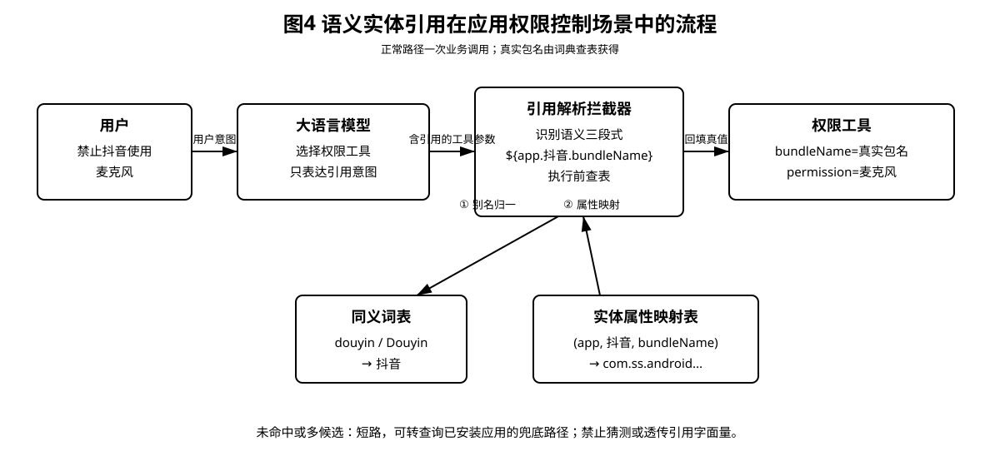
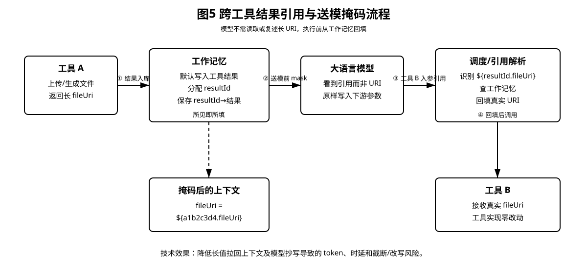
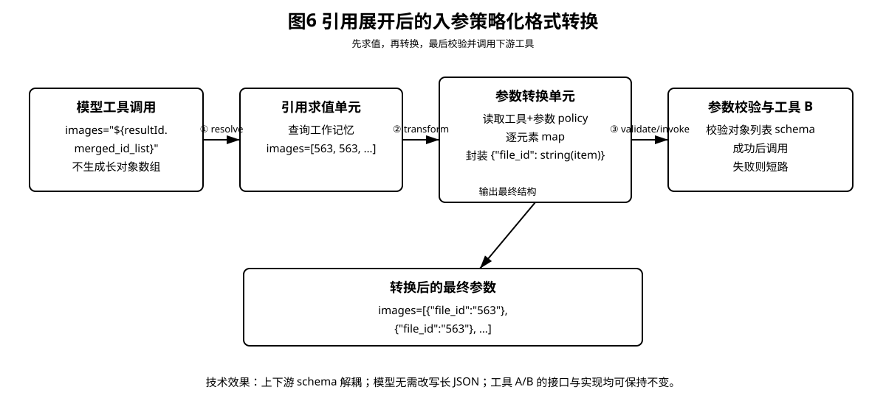

# 交底书 · 应用场景及附图说明

**发明名称：** 一种面向智能体工具链的参数引用解析机制

本节单独描述本发明的典型应用场景。以下场景均以“大语言模型输出引用意图、运行时在工具执行前求值并回填”为共同技术基础，但分别解决弱语义标识幻觉、跨工具长值传递以及上下游参数结构不一致的问题。所列场景仅为示例，不构成对应用范围的限制。

---

## 场景一：应用包名等弱语义业务标识的确定

在手机、电视、车载设备等应用操控场景中，业务工具通常要求以应用包名、Bundle Identifier、应用用户模型标识等作为参数。此类标识命名不统一、语义性弱，用户通常只会表达应用名称，例如“抖音”或“微信”。

传统方式需要模型先调用“查询全部已安装应用”类工具，在下一轮从查询结果中抄写真实包名，再调用权限管理、应用跳转等业务工具；若模型跳过查询并凭记忆填写，则容易产生虚假包名。

如图A所示，本发明中模型直接在业务工具的标识参数中填写语义实体引用，例如：

```text
${app.抖音.bundleName}
```

工具执行前，引用解析拦截器依次完成以下处理：

1. 识别命名空间、实体和属性三个组成部分；
2. 通过同义词表将“douyin”“Douyin”“抖音”等归一为同一规范实体；
3. 通过实体属性映射表查询对应的真实包名；
4. 将查询结果回填至业务工具参数；
5. 映射未命中或存在多个候选时短路，不允许模型猜测，也不将引用字面量传递给工具。

映射命中时，模型可以直接发起权限管理等业务工具调用，无需先执行全量查询，从而将正常路径由两次工具循环缩减为一次业务调用。

**图A：语义实体引用在应用权限控制场景中的流程**  


---

## 场景二：跨工具传递长URI、文件标识或大字段

在文件上传、内容生成、图像处理、文件分析等工具链中，工具A可能返回较长的文件URI、文件标识或对象标识，工具B需要继续使用该字段。

传统方式将工具A的完整结果重新输入模型，由模型在工具B参数中原样复述长值。该方式会增加上下文长度，并容易产生截断、漏字符或改写。

如图B所示，本发明按照以下流程处理：

1. 工具A成功返回后，调度模块将结果默认写入工作记忆，并分配结果标识；
2. 对模型无需理解的字段，可在送入模型之前将真值掩码为结果引用；
3. 模型调用工具B时，将看到的引用原样写入对应参数；
4. 工具执行前，引用解析拦截器从工作记忆中取出真实字段值并回填；
5. 工具B只接收真实URI或标识，不需要识别引用协议。

该场景实现“所见即所填”，使模型不再承担长字符串抄写任务，并保持存量工具的接口与实现不变。

**图B：跨工具结果引用与送模掩码流程**  


---

## 场景三：引用展开后对下游工具入参进行格式转换

在多个工具串联时，上游工具输出结构和下游工具入参结构可能不一致。例如，工具A输出标识列表：

```text
[563, 563, …]
```

而工具B的 `images` 参数要求对象列表：

```text
[{"file_id":"563"}, {"file_id":"563"}, …]
```

若由模型完成逐项转换，列表稍长即容易产生遗漏、字段名错误或类型错误；若逐个修改上下游工具协议，则难以规模化。

如图C所示，本发明在引用解析和工具执行之间增加参数策略化转换阶段：

1. 模型仅将上游列表字段的结果引用写入 `images` 参数；
2. 引用求值单元从工作记忆取得真实列表；
3. 参数转换单元读取与“工具B + images参数”绑定的转换策略；
4. 转换单元对列表中的每个元素执行映射，以该元素的字符串形式构造 `file_id` 字段对象；
5. 参数校验单元确认转换结果符合工具B的参数结构后再执行工具；
6. 转换或校验失败时短路，不向工具B传递半成品参数。

转换策略的自然语言语义可以描述为：

> 将引用展开后列表中的每个元素转换为一个对象，该对象包含字段 `file_id`，其值为该元素的字符串形式；保持原列表顺序，并以转换后的对象列表作为参数 `images` 的最终值。

该方案把“引用求值”和“结构适配”组成统一的执行前参数处理流水线，使模型无需生成长对象数组，并使上下游工具保持零改动。

**图C：引用展开后的入参策略化格式转换**  


---

## 其他可扩展应用场景

1. **模型需要读取内容但仍以引用传参：** 模型可阅读正文或摘要完成推理，但向下一工具传递时仍使用结果引用，实现“看”与“传”分离。
2. **跨平台业务标识：** 语义实体映射可以增加操作系统、ROM、设备类型和版本维度，使同一应用名称在不同平台下映射至不同标识。
3. **联系人、设备及业务对象标识：** 命名空间可以由应用扩展至联系人、智能设备、车辆、媒体资源、订单等业务对象。
4. **多候选消歧：** 当同一实体对应多个标识时，运行时返回候选并要求模型或用户选择，不进行静默猜测。
5. **离线或端云协同求值：** 与设备强相关的标识可在端侧词典求值，云端工具结果引用可在云端工作记忆求值，最终在工具执行前合并并校验。

---

## 附图文件说明

| 图号 | 附图文件 | 形式 |
|------|----------|------|
| 图A | `assets/patent-scenario-app-identifier.svg` | 黑白、无灰度、可编辑SVG |
| 图B | `assets/patent-scenario-result-transfer.svg` | 黑白、无灰度、可编辑SVG |
| 图C | `assets/patent-scenario-format-transform.svg` | 黑白、无灰度、可编辑SVG |

对应PNG文件仅用于预览；正式交底书建议插入SVG或将SVG导入绘图软件后转为专利附图要求的可编辑线图。
