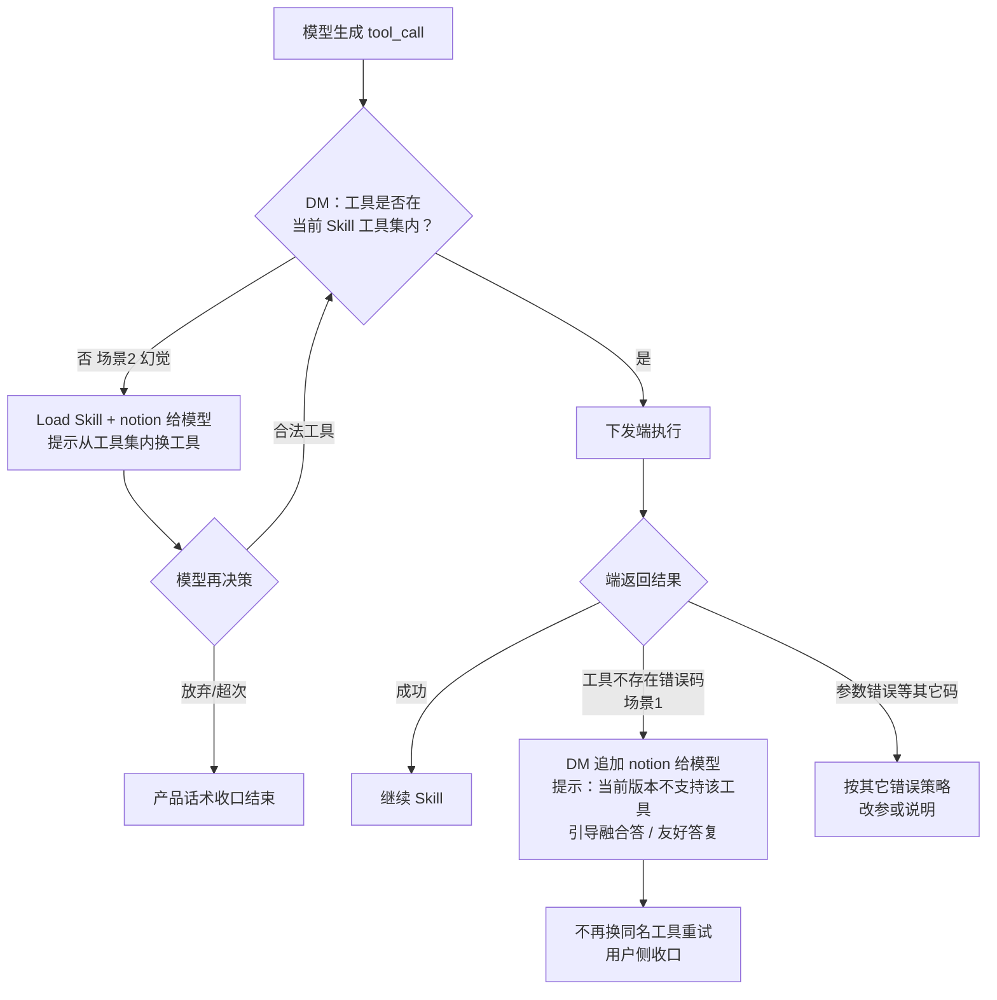

# 工具调用异常处理方案（按最新对齐纪要整理）

> 对齐口径：单 Skill 收编下，Runtime/DM 执行前校验 + 端错误码分流；幻觉可换工具，端不存在则不重试并友好引导。  
> 覆盖：端意图、端 CLI、ArkTS、小艺封装工具；云工具（MCP 等）在「进一步」中统一 router 预检。

---

## 一、现状

| 通道 | 现状 | 缺口 |
|------|------|------|
| 端意图 | 意图不存在会报 `-304 invalid_intent_error` | 需确认：**意图名不对**与**参数不对**是否都报同一错误；若是，**端需区分上报**（@陈科润） |
| 端 CLI | **已支持**返回错误码（含工具不存在类） | 与 DM 错误码语义对齐、统一分流即可 |
| ArkTS 脚本 | **已支持**工具不存在类错误 | 同上 |
| 小艺封装工具 | 能力分散 | 考虑按需在平台管理配置（@张慧） |
| 云工具 / MCP | 调用路径与端不完全一致 | 见「进一步」：router 先查是否支持 |

**关键澄清（意图框架）：**

- 若 `-304` 同时覆盖「名不存在」和「参数非法」，则无法正确走「换工具」vs「改参数/友好拒答」分支。  
- 目标：端侧至少拆出（或可映射到 DM 的）两类语义——**工具不存在** vs **参数/校验失败**。

---

## 二、两个场景（先分清，再分流）

| 场景 | 含义 | 处理原则 |
|------|------|----------|
| **场景1** | Skill 工具集里**有**该工具，但**端不存在**/当前版本不支持 | **不重试换工具**；结合错误码给友好答复（当前版本不支持）+ 融合答引导语 |
| **场景2** | Skill 工具集里**没有**该工具，属**模型幻觉** | 提示模型**换一个在 Skill 工具集内的工具**（已支持） |

```text
                    模型产出 tool_call
                            │
                            ▼
              ┌─ 是否在当前 Skill 工具集内？ ─┐
              │否（场景2 幻觉）     │是（候选真实依赖）
              ▼                    ▼
        给模型 notion：        下发端 / 对应执行器
        换白名单内工具              │
        （可有限次）                 ▼
                            端返回「工具不存在」？
                              │是 → 场景1
                              ▼
                        不重试；notion 引导
                        「当前版本不支持」+ 融合答
```

---

## 三、修改一：单 Skill 收编 —— 执行前校验（Runtime / DM）

**责任：** @夏捷（开发计划-遗留）、@曹辉、@汤继善  

模型发出的工具调用指令，**Runtime 在执行前必须校验**：

| 判定 | 结论 | 动作 |
|------|------|------|
| ① **不在** Skill 工具集 | 模型幻觉 | 给提示让模型换工具 —— **已支持** |
| ② **在** Skill 工具集，但端上报「工具不存在」 | 版本/端能力不支持 | **不重试**；按错误码走友好答复（当前版本不支持）+ 融合答引导语 |

### 3.1 流程图（DM 主路径）



### 3.2 文字步骤（与纪要一致）

**Step1**  
模型生成工具调用时，**DM 先判断**该工具是否在 Skill 的工具集内：

- **有** → 下发端执行  
- **无** → Load Skill 和对应 **notion** 给到模型（提示换工具，场景2）

**Step2**  
端返回工具执行结果；若不支持该工具，返回明确的「工具不存在 / 不支持」**错误码**。

**Step3**  
DM 基于端返回的错误码，**增加 notion 给模型**，提示给出用户引导（例：当前版本不支持该工具），走融合答；**不进入「再换一个工具重试」闭环**（场景1）。

### 3.3 场景对照（执行策略）

| | 场景2 幻觉 | 场景1 Skill 有、端无 |
|--|------------|----------------------|
| 校验位置 | DM 执行前（工具集） | 端执行后（错误码） |
| 是否让模型换工具 | **是**（白名单内） | **否** |
| 给模型的 notion | 工具不在 Skill 集，请改调 | 端不支持/当前版本不支持，请友好引导用户 |
| 用户侧 | 尽量靠换合法工具完成任务 | 明确「当前版本不支持」类引导，避免空转 |

### 3.4 错误码对齐要求（端）

| 来源 | 要求 | 负责人 |
|------|------|--------|
| 意图框架 | 排查 `-304`；**新增或拆分「工具不存在」错误码**（与参数错误分离） | @李伟峰、@曹辉；确认现状 @陈科润 |
| CLI | 已支持工具不存在错误码 → 与 DM 枚举对齐 | 已支持 |
| ArkTS | 已支持工具不存在 → 与 DM 枚举对齐 | 已支持 |
| 小艺封装工具 | 按需平台配置/登记，保证能报「不存在」 | @张慧 |

**DM 侧建议映射（示例）：**

| 端/通道语义 | DM 内部语义 | 走哪条分支 |
|-------------|-------------|------------|
| 工具名不存在 / 未注册 | `TOOL_NOT_FOUND_ON_DEVICE` | 场景1：不重试 + 版本不支持引导 |
| 不在 Skill 工具集 | `TOOL_NOT_IN_SKILL` | 场景2：notion 换工具 |
| 参数非法 | `TOOL_SCHEMA_INVALID` | 改参/说明，不走「版本不支持」 |
| 其它执行失败 | `TOOL_EXEC_FAILED` | 既有失败策略 |

---

## 四、修改二：平台按 ROM 小版本配置 Skill（兜底）

**责任：** @尹龙  

| 项 | 说明 |
|----|------|
| 能力 | 迭代平台支持按 **ROM 小版本**配置对应 Skill |
| 原则 | **ROM 小版本不支持多 Skill**；仅 **大版本**支持多 Skill |
| 补充 | 当 ROM 不便比较大小时，平台用 **黑白名单**管理 |
| 现状 | **已经支持** |
| 节奏 | **先通过本方案（修改一）不阻塞过点**；修改二作配套兜底，不挡主路径 |

与「Skill↔Tool 能力匹配 / 多版本」长期方案可并行；过点优先保证修改一的 DM 分流体验。

---

## 五、进一步（待定）

| 项 | 说明 | 责任人 |
|----|------|--------|
| Router 预检 | DM 对模型决策的工具调用，**router（端工具 / 云工具，区分 invoke）要先检查对应工具是否支持**；当前可查意图框架 | @夏捷、@李阜 |
| 端意图框架 | 新增「工具不存在」错误码，与参数错误区分 | @李伟峰、@曹辉 |
| CLI & ArkTS | 已支持工具不存在，对齐 DM | — |
| 小艺封装工具 | 按需在平台管理配置 | @张慧 |
| 云 MCP 等 | 纳入同一 router 预检与错误码映射，避免只拦端、不拦云 | 随 router 方案一并定 |

**待定目标形态：**

```text
模型 tool_call
  → DM：是否在 Skill 工具集？（修改一①）
  → Router：该 invoke 通道上工具是否支持？（端意图框架 / 云目录 / …）
  → 执行
  → 错误码分流（场景1 vs 其它）
```

---

## 六、Notion / 话术要点（产品可落文案）

| 触发 | 给模型的 notion 意图 | 用户侧期望 |
|------|----------------------|------------|
| 不在 Skill 工具集 | 指出非法工具名；列出/强调 Skill 内可用工具；请改调 | 尽量无感完成或短澄清 |
| 端返回工具不存在 | 明确**不要再换工具重试**；请用融合答说明**当前版本不支持**并给可执行建议 | 友好、可理解、立即收口 |

（具体话术由产品提供；平台可配默认 + Skill 覆盖。）

---

## 七、过点清单（建议）

**修改一（过点必须）：**

- [ ] DM：Skill 工具集校验（①幻觉换工具）——已支持，回归确认  
- [ ] DM：端「工具不存在」→ 不重试 + notion 引导（②场景1）——待开发/联调  
- [ ] 端：意图「工具不存在」与参数错误可区分上报  
- [ ] CLI / ArkTS 错误码与 DM 映射联调通过  

**修改二（不阻塞）：**

- [ ] 沿用已支持的 ROM 小版本 / 黑白名单配置作兜底  

**进一步（排期）：**

- [ ] Router 端/云 invoke 前支持性检查  
- [ ] 封装工具平台化按需配置  

---

## 八、一句话

> **先看在不在 Skill 里：不在 → 幻觉，让模型换工具；在 → 才下发。端说没有 → 就是当前版本不支持，不重试，友好引导收口。** ROM 小版本配 Skill 作平台兜底，已支持且不挡修改一过点。
