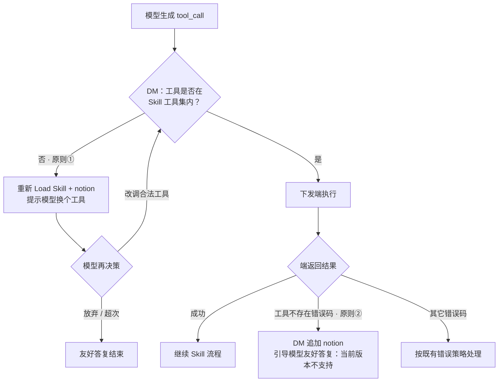

# 工具调用异常处理方案

## 一、背景

语音助手按 Skill 调度工具时，模型可能生成不存在或不匹配端侧能力的工具调用，典型有两类：

1. **模型幻觉**：调用了当前 Skill 工具集之外的工具名。
2. **版本 / 端能力缺口**：工具在 Skill 里有声明，但当前 ROM / 应用上并不存在或不可用。

两类问题若都当成「再试一次 / 换个工具」，会导致空转重试、用户等待过久且答复含糊。需要在执行链路上分清两者，分别处理。

---

## 二、修改方案

### 方案一：单 Skill 收编（Runtime / DM 执行前校验）

**原则**

| 原则 | 判定 | 动作 |
|------|------|------|
| ① | 不在 Skill 工具集 | 模型幻觉 → 提示换工具（**已支持**） |
| ② | 在 Skill 工具集，但端报「工具不存在」 | **不重试**；按错误码给友好答复（如：当前版本不支持） |

**具体实现**

| 步骤 | 内容 |
|------|------|
| Step1 | DM 判断工具是否在 Skill 工具集：有则下发端；无则重新 Load Skill + notion，提示模型换个工具 |
| Step2 | 收到工具执行指令后，端返回不支持 / 工具不存在错误码（意图框架端工具需新增支持「工具不存在」错误码；CLI 工具已支持） |
| Step3 | DM 收到端工具执行返回的错误码后追加 notion，引导模型做友好答复 |

**流程**

---

### 方案二：平台兜底（先按该方案支持，不阻塞过点）

**原则③**：仅按 **ROM 大版本**配置 Skill；仅在需要快速干预时使用**白名单**。

**具体实现**

- 迭代平台支持 Skill 配置**版本白名单**，用于支撑 ROM 小版本场景（**已支持**）。

---

## 三、后续（待定）

现有意图框架工具已支持在 IDS 中查询某能力在端版本是否存在。后续考虑将 **小艺封装工具、CLI 工具、MCP 工具** 等均按需在平台基于版本进行配置管理，用于 DM 在执行工具调度前检查工具是否存在，把「端报不存在」前移为「执行前拦截」。

---

## 四、小结

| 场景 | 处理 |
|------|------|
| 幻觉（不在 Skill 集） | 提示换工具，可有限次再决策，放弃则友好答复 |
| 端不存在（在 Skill 集） | 不重试，按错误码友好答复「当前版本不支持」 |
| 平台兜底 | ROM 大版本配 Skill；小版本靠版本白名单快速干预 |
| 后续 | 各类工具按版本在平台管理，DM 执行前检查 |
